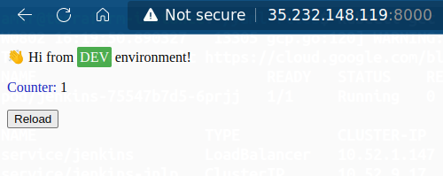

# Deploy backend application on kubernetes cluster using CI/CD jenkins pipeline.
- ### Implement secure Kubernetes cluster
- ### Deploy and configure Jenkins on Kubernetes.
- ### Deploy backend application on Kubernetes using Jenkins pipeline.
## What to do?

## Tools used in Project:
- GCP and Terraform

- Docker and Dockerhub , Kubernetes  and Jenkins

## Infastructure: 
- Service-account
- VPC
- 2 private-subnets (management, restricted)
- nat
- cloud-router
- firewall (Allow ssh and http)
- vm (bastion host)
- GKE 

## Steps:
### 1) Apply the infrastructure using Terraform 
```bash
$ terraform apply --var-file prod.tfvars
```
### 2) SSH to the bastion host
```bash
gcloud compute ssh --zone "us-central1-a" "terraform-instance"  --tunnel-through-iap --project "gcp-project-356819"
```
### 3) Apply this commands to connect to the GKE cluster
```bash
$ curl -O https://dl.google.com/dl/cloudsdk/channels/rapid/downloads/google-cloud-cli-394.0.0-linux-x86_64.tar.gz
$ tar -xf google-cloud-cli-394.0.0-linux-x86_64.tar.gz
$ ./google-cloud-sdk/install.sh
$ ./google-cloud-sdk/bin/gcloud init

# install gcloud packages and update repo
$ sudo apt-get install apt-transport-https ca-certificates gnupg
$ echo "deb [signed-by=/usr/share/keyrings/cloud.google.gpg] https://packages.cloud.google.com/apt cloud-sdk main" | sudo tee -a /etc/apt/sources.list.d/google-cloud-sdk.list
$ curl https://packages.cloud.google.com/apt/doc/apt-key.gpg | sudo apt-key --keyring /usr/share/keyrings/cloud.google.gpg add -
$ sudo apt-get update

$ sudo apt-get install google-cloud-sdk-gke-gcloud-auth-plugin

$ sudo apt-get install kubectl

# connect to the cluster
$ gcloud container clusters get-credentials my-gke-cluster --region us-central1 --project gcp-project-356819

# check cluster connection 
$ kubectl get nodes
```
### 4) Deploy app on kubernetes cluster
- ###  Run a deployment has a pod with running container with jenkins base image and docker , kubectl installed. go to the link for more details about the deployment [Jenkins Deployment](https://github.com/AmeerHossam/Final-Project-ITI/blob/master/Deployment-jenkins/jen-deployment.yaml).
- ### Run 2  services (Load Balancer) to get access to jenkins pod  and (ClusterIP service) to make the service is reachable within the cluster , Check the service file [Services file](https://github.com/AmeerHossam/Final-Project-ITI/blob/master/Deployment-jenkins/services.yaml).
- ### Create PVC and storageClass to keep the data of the deployment saved , Check the configuration files [PVC file](https://github.com/AmeerHossam/Final-Project-ITI/blob/master/Deployment-jenkins/PVC.yaml) and [Storage Class file](https://github.com/AmeerHossam/Final-Project-ITI/blob/master/Deployment-jenkins/storageClass.yaml).
- ### Create  k8s Service account to make the pods manipulate on the k8s cluster's objects , Check the Service-account file [Service account](https://github.com/AmeerHossam/Final-Project-ITI/blob/master/Deployment-jenkins/service-account.yaml).

## Check the jenkins deployment and services:
```bash
amir@terraform-instance:~/yaml-files$ kubectl get all
W0802 21:38:15.388328    7110 gcp.go:120] WARNING: the gcp auth plugin is deprecated in v1.22+, unavailable in v1.25+; use gcloud instead.
To learn more, consult https://cloud.google.com/blog/products/containers-kubernetes/kubectl-auth-changes-in-gke
NAME                          READY   STATUS    RESTARTS   AGE
pod/jenkins-75547b7d5-6prjj   1/1     Running   0          5h33m

NAME                   TYPE           CLUSTER-IP    EXTERNAL-IP    PORT(S)          AGE
service/jenkins        LoadBalancer   10.52.1.147   34.136.18.44   8080:31243/TCP   7h15m
service/jenkins-jnlp   ClusterIP      10.52.9.17    <none>         50000/TCP        7h15m

NAME                      READY   UP-TO-DATE   AVAILABLE   AGE
deployment.apps/jenkins   1/1     1            1           5h33m

NAME                                DESIRED   CURRENT   READY   AGE
replicaset.apps/jenkins-75547b7d5   1         1         1       5h33m

```

### Check the app deployment on  the service on the "dev"  namespace:
```bash
amir@terraform-instance:~/yaml-files$ kubectl get all -n  dev
W0802 21:44:53.805047    8392 gcp.go:120] WARNING: the gcp auth plugin is deprecated in v1.22+, unavailable in v1.25+; use gcloud instead.
To learn more, consult https://cloud.google.com/blog/products/containers-kubernetes/kubectl-auth-changes-in-gke
NAME                              READY   STATUS    RESTARTS   AGE
pod/visits-app-85c5b5c884-wp8dq   1/1     Running   0          130m

NAME                 TYPE           CLUSTER-IP    EXTERNAL-IP      PORT(S)          AGE
service/my-service   LoadBalancer   10.52.10.28   35.232.148.119   8000:30020/TCP   5h30m

NAME                         READY   UP-TO-DATE   AVAILABLE   AGE
deployment.apps/visits-app   1/1     1            1           130m

NAME                                    DESIRED   CURRENT   READY   AGE
replicaset.apps/visits-app-85c5b5c884   1         1         1       130m
```
### 5) for more information about the jenkins file , creating the deployment for running the application on another name space , Please check this link [Pipeline](https://github.com/AmeerHossam/Final-Pipe)

### 6) ensure that the app is running

